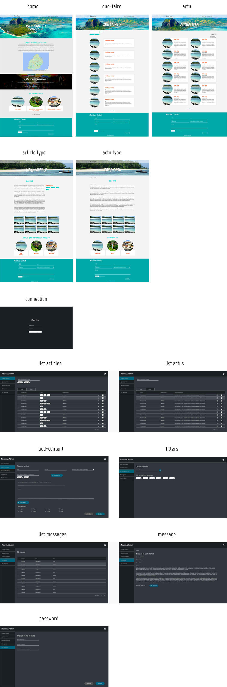

# Mauritius Webapp
*(en cours de développement)*

[[_TOC_]]

## Introduction
Ce projet s'inscrit dans le cadre de la formation de Développement Fullstack Javascript
proposé par l'école informatique [White Rabbit](link) et a pour but réaliser une application
web complète (backend/frontend).

### Environnement technique

- MongoDB
- Express
- ReactJS
- NodeJS

### L'Équipe (Ordre alphabétique) 

Juan Carlos Boy
Audrey Igouassel
Hadi Jamal Ahmad
Kayaam LOISEAU
Maxime Roche-Thorel
Salah Salaheddine

## Les maquettes

